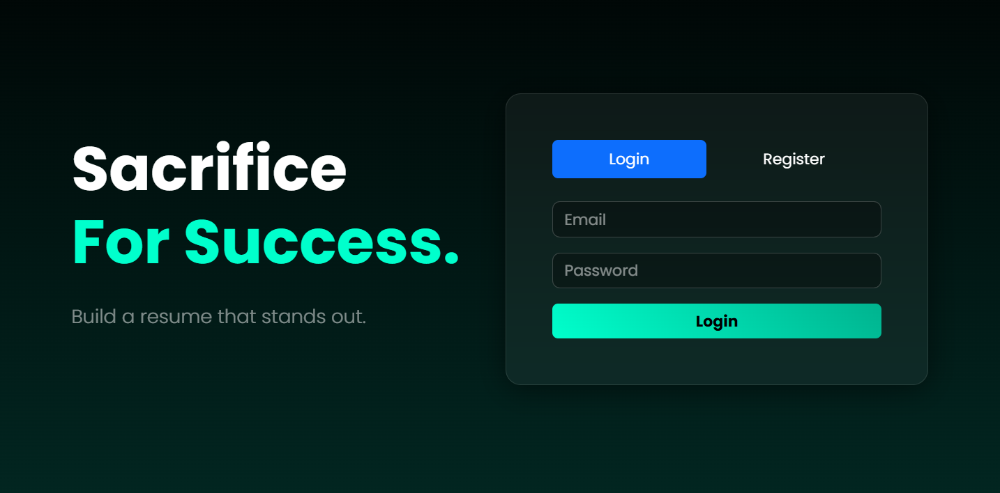
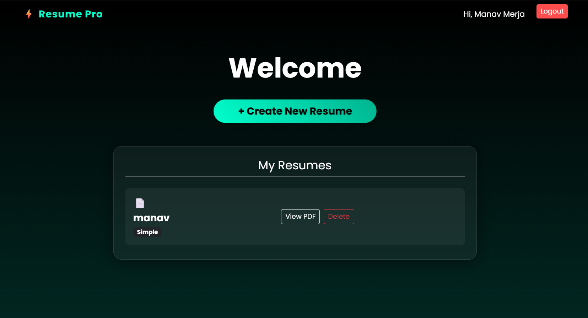
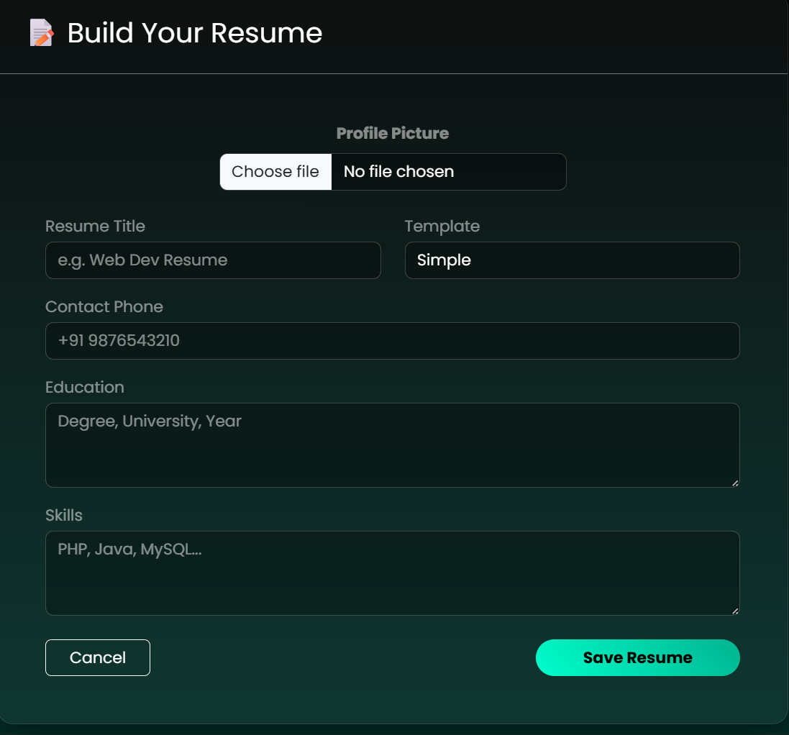
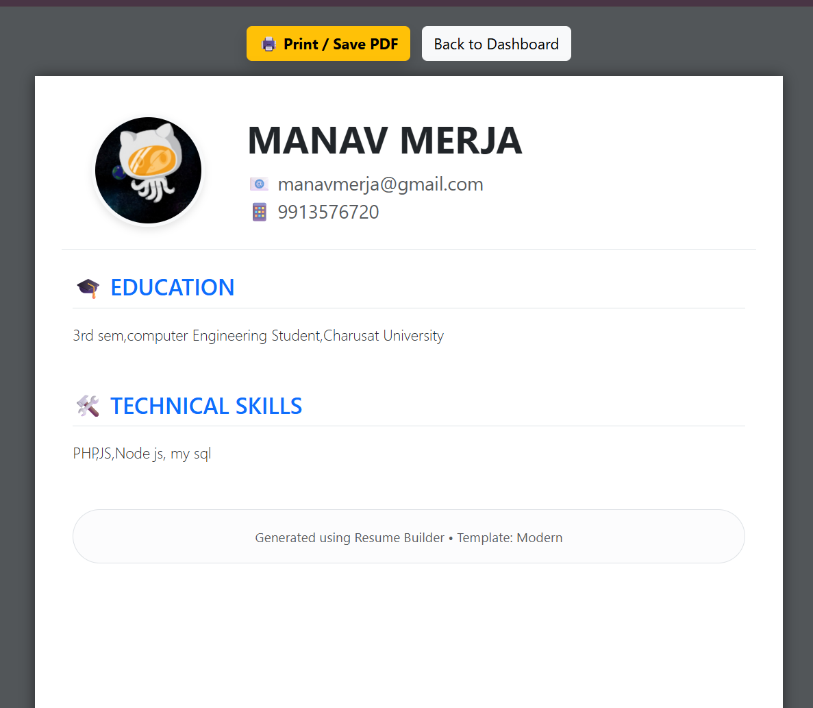

# ⚡ Resume Pro - Resume Builder

> A modern, dark-themed web application that allows users to build, manage, and download professional resumes in seconds. Built with **Core PHP**, **MySQL**, and **Bootstrap 5**.


---

## 🌐 Live Demo
🚀 **[Click Here to View Live Project](http://resume-pro.rf.gd/)** *(Note: If the link is down, please follow the installation steps below to run locally.)*

---

| Login Page (Dark Mode) | Dashboard (Glassmorphism) |
|:----------------------:|:-------------------------:|
|  |  |

| Create Resume Form | PDF View (A4 Layout) |
|:------------------:|:--------------------:|
|  |  |
---

## ✨ Key Features

### 🎨 UI/UX Design
-   **Dark & Neon Theme:** Professional dark mode with a 'Sacrifice' gradient aesthetic.
-   **Glassmorphism:** Translucent cards and inputs for a modern feel.
-   **Mobile Responsive:** Fully responsive navbar with hamburger menu and stacked layouts.
-   **Animations:** Smooth entry animations using `Animate.css`.

### 🛠️ Core Functionality
-   **User Authentication:** Secure Login & Registration with **Bcrypt Password Hashing**.
-   **Dynamic Resume Builder:** Form-based input for Education, Skills, and Contact info.
-   **Image Upload:** Users can upload profile pictures (displayed circularly on PDF).
-   **Template System:** Uses **Cookies** to remember the user's last selected template ('Simple' vs 'Modern').
-   **PDF Generation:** Client-side **Print-to-PDF** using custom CSS media queries (No external libraries required).
-   **CRUD Operations:** Full capability to Create, Read, View, and Delete resumes.
-   **Security:** -   SQL Injection protection.
    -   HTTPS enforcement via `.htaccess`.
    -   Session management.

---

## ⚙️ Tech Stack

-   **Frontend:** HTML5, CSS3, Bootstrap 5 (CDN), Animate.css, Google Fonts (Poppins).
-   **Backend:** PHP (Procedural Style).
-   **Database:** MySQL (Relational DB).
-   **Server:** Apache (XAMPP / InfinityFree).

---

## 🚀 Installation Guide (Run Locally)

Follow these steps to run the project on your machine:

### 1. Prerequisites
-   Install **XAMPP** or **WAMP**.
-   Git installed on your system.

### 2. Clone the Repository
```bash
git clone [https://github.com/YOUR_USERNAME/resume-pro.git](https://github.com/YOUR_USERNAME/resume-pro.git)
3. Database Setup
Open phpMyAdmin (http://localhost/phpmyadmin).

Create a database named resume_pro.

Import the database.sql file provided in this repository.

OR run this SQL command:

SQL

CREATE TABLE users (
    id INT AUTO_INCREMENT PRIMARY KEY,
    name VARCHAR(100) NOT NULL,
    email VARCHAR(100) UNIQUE NOT NULL,
    password VARCHAR(255) NOT NULL
);

CREATE TABLE resumes (
    id INT AUTO_INCREMENT PRIMARY KEY,
    user_id INT NOT NULL,
    title VARCHAR(100),
    template VARCHAR(50) DEFAULT 'Simple',
    phone VARCHAR(20),
    education TEXT,
    skills TEXT,
    profile_pic VARCHAR(255) DEFAULT NULL,
    FOREIGN KEY (user_id) REFERENCES users(id) ON DELETE CASCADE
);
4. Configuration
Open db.php.

Edit the connection details if necessary:

PHP

$conn = mysqli_connect("localhost", "root", "", "resume_pro");
5. Run
Move the project folder to C:\xampp\htdocs\.

Open your browser and visit: http://localhost/resume-pro/index.php

📂 Folder Structure
Plaintext

resume-pro/
├── uploads/           # Stores user profile pictures
├── screenshots/       # Images for README
├── create.php         # Resume creation form
├── db.php             # Database connection
├── delete.php         # Deletion logic
├── index.php          # Login + Dashboard
├── style.css          # Custom Dark CSS
├── view.php           # Resume PDF View
├── database.sql       # SQL export
└── README.md          # Documentation
👤 Author
Manav Merja

GitHub: @https://github.com/manavmerja

LinkedIn: https://www.linkedin.com/in/merja-manav-124ba7317/

🤝 Contributing
Contributions, issues, and feature requests are welcome!

Made with ❤️ and PHP.